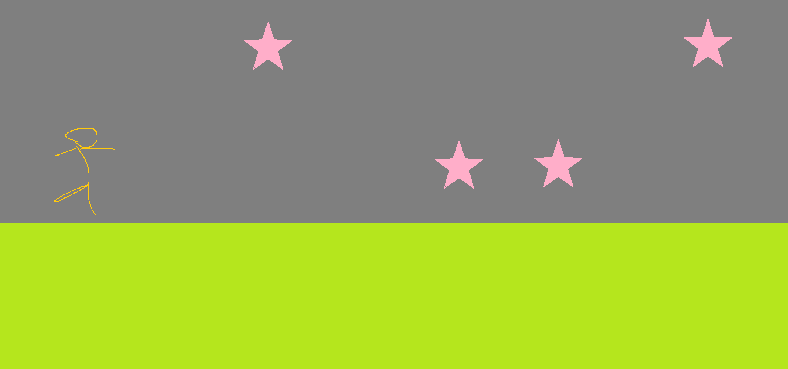

# 코틀린 대쉬
코틀린으로 만드는 리듬 게임

---

- [x] 프로토타입
- [x] 예광탄 개발
- [x] 테스트 주도 개발
- [x] 객체지향 프로그래밍
- [x] 전역 변수--싱글톤
- [ ] 계약의 의한 설계
- [ ] 단정 프로그래밍
- [ ] 협업

---

- [ ] Gradle Kotlin DSL
- [x] libGDX with Kotlin 
- [x] Github VCS
- [ ] Java

---

## 개발하고 싶은 인상적인 부분
1. 필터나 파티클이나 화면 변형 효과
2. 리듬 게임 자체의 재미 타격감
3. 단순한 디자인

